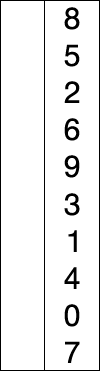
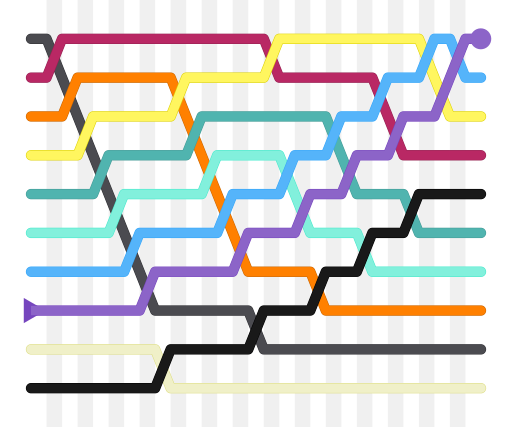

# 基本排序

## 选择排序 O(n^2^)

选择排序（Selection sort）是一种简单直观的排序算法。它的工作原理如下。首先在未排序序列中找到最小元素，存放到排序序列的起始位置，然后，再从剩余未排序元素中继续寻找最小元素，然后放到已排序序列的末尾。以此类推，直到所有元素均排序完毕。

选择排序的主要优点与数据移动有关。如果某个元素位于正确的最终位置上，则它不会被移动。选择排序每次交换一对元素，它们当中至少有一个将被移到其最终位置上，因此对 n 个元素的表进行排序总共进行至多(n-1)次交换。在所有的完全依靠交换去移动元素的排序方法中，选择排序属于非常好的一种。

选择排序的示例动画。红色表示当前最小值，黄色表示已排序序列，蓝色表示当前位置:

使用选择排序为一列数字进行排序的过程：

## 插入排序 O(n^2^)

插入排序（英语：Insertion Sort）是一种简单直观的排序算法。它的工作原理是通过构建有序序列，对于未排序数据，在已排序序列中从后向前扫描，找到相应位置并插入。插入排序在实现上，通常采用 in-place 排序（即只需用到 O(1)的额外空间的排序），因而在从后向前扫描过程中，需要反复把已排序元素逐步向后挪位，为最新元素提供插入空间。

使用插入排序为一列数字进行排序的过程:

## 冒泡排序

**冒泡排序**（英语：**Bubble Sort**）又称为**泡式排序**，是一种简单的[排序算法](https://zh.wikipedia.org/wiki/排序算法)。它重复地走访过要排序的[数列](https://zh.wikipedia.org/wiki/数列)，一次比较两个元素，如果他们的顺序错误就把他们交换过来。走访数列的工作是重复地进行直到没有再需要交换，也就是说该数列已经排序完成。这个算法的名字由来是因为越小的元素会经由交换慢慢“浮”到数列的顶端。

冒泡排序彩条：

使用冒泡排序为一列数字进行排序的过程：

## 希尔排序

**希尔排序**（Shellsort），也称**递减增量排序算法**，是[插入排序](https://zh.wikipedia.org/wiki/插入排序)的一种更高效的改进版本。希尔排序是非稳定排序算法。

希尔排序算法彩条：

以 23, 10, 4, 1 的步长序列进行希尔排序：

冒泡排序、插入排序、归并排序、基数排序是稳定的排序算法，
选择排序、快速排序、希尔排序、堆排序是不稳定的排序算法。
